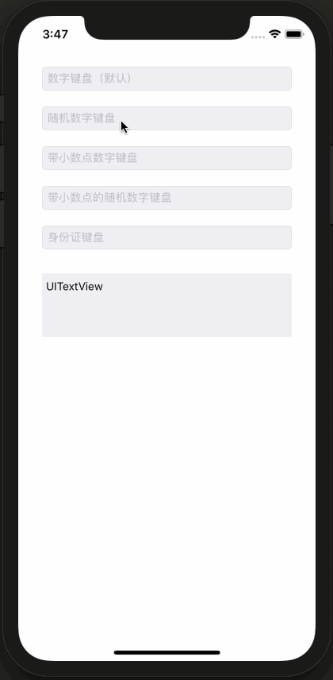
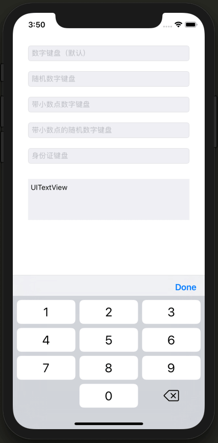
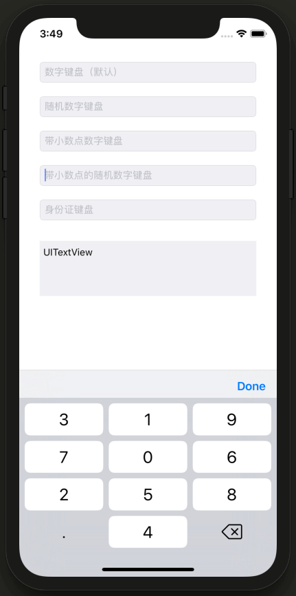
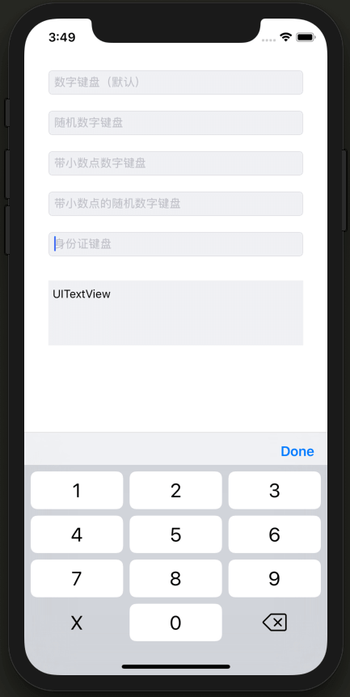

# SKSecurityKeyboard

iOS 安全键盘

## 特性

- 支持多种数字键盘类型(纯数字、带小数点、身份证、随机等)
- 完美支持长按删除功能
- 支持按键音效果

## 用法

- 将 `SKSecurityKeyboard` 文件夹拖入项目
- 设置 UITextField/UITextView 的 `enabledSecurityKeyboard` 属性为 `YES` 即可

## 演示 & 效果图

## TODO

- 横竖屏适配待完善
- 按键的底部阴影效果(使其看起来更加像系统键盘)
- 删除按钮的特殊音效

## License

基于MIT License进行开源，详细内容请参阅 `LICENSE` 文件。